# ANALYSING EMPLOYEE REVIEW IN A CORPORATE ORGANIZATION USING SQL

*Credits: Photo by Alexander Suhorucov https://www.pexels.com/photo/diverse-successful-businesswomen-smiling-and-walking-together-in-modern-workplace-6457562/*

# INTRODUCTION

In this repository, I carry out a data analysis project using an employee_review dataset to find out work-life balance, income, job satisfaction and other rating metrics that overall make working more fulfilling for employees. I explore data preprocessing, SQL queries, and categorization.

#### *Disclaimer: This is a dummy dataset and is not associated with any individual or organization.*

---

# PROBLEM STATEMENT
---
1. FIND THE JOB TITLES IN THE "SOFTWARE_DEVELOPMENT_DEPARTMENT" THAT HAVE A "WORK LIFE BALANCE" RATING GREATER THAN 4 AND A "SALARY_AND_BENEFIT" RATING GREATER THAN 4.5.
---
2. USING THE 'CASE' STATEMENT, CREATE A NEW COLUMN THAT SPECIFIES EVERYTHING GREATER THAN 4 FOR THE WHOLE QUALITIES AS "EXCELLENT", HAVING ATLEAST TWO QUALITIES GREATER THAN 3 AS "GOOD" AND EVERY OTHER THING AS "POOR".
   
---

# SQL SKILLS UTILIZED IN THIS PROJECT:
-	CREATE DATABASE
-	CREATE TABLE
-	INSERT INTO
-	SELECT Statement
-	SELECT INTO
-	WHERE Clause
-	SELECT * FROM
-	IS NULL
-	AGGREGATE FUNCTIONS
-	CASE Statement
-	SELECT DISTINCT
-	UPDATE
-	ALTER

---

# SQL QUERIES AND SYNTAXES

1.	Creating a Database:

The first step was to create a Database using the CREATE DATABASE syntax.

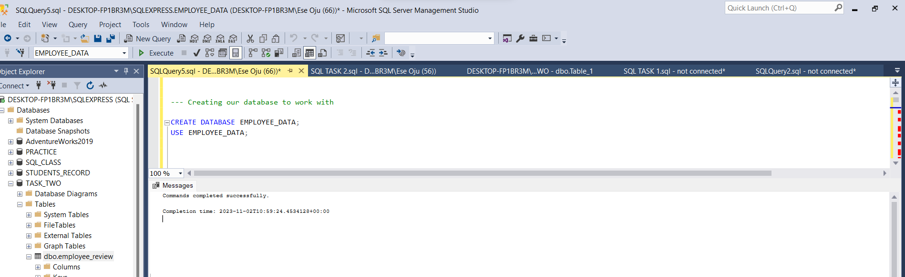 

---

2.	Data Preprocessing:
-	I imported my dataset which is a flat file, ‘Employee_review.csv’ and then opened it using the syntax SELECT * FROM syntax. This enabled me to have an overview of the dataset.
  
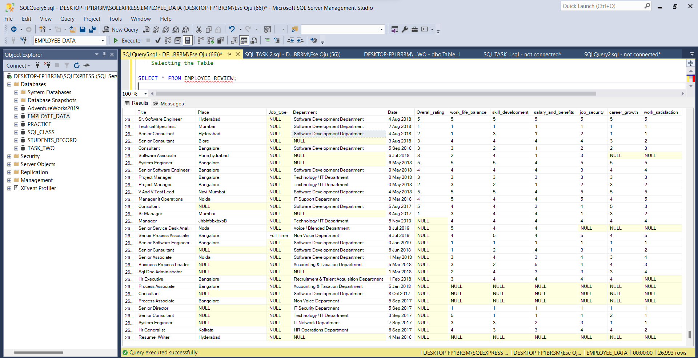

---
-	I used SELECT DISTINCT to Count the number of rows in the dataset. Then I also checked for NULL Values. As shown above, even before doing a thorough check, the dataset has obvious Null values.

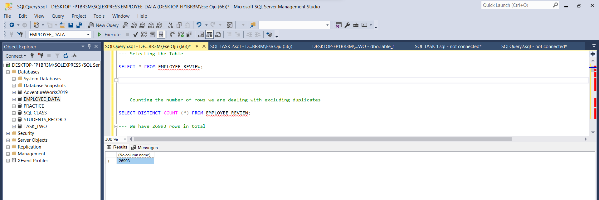

--- 
-	I checked for Null Values in the Categories Column

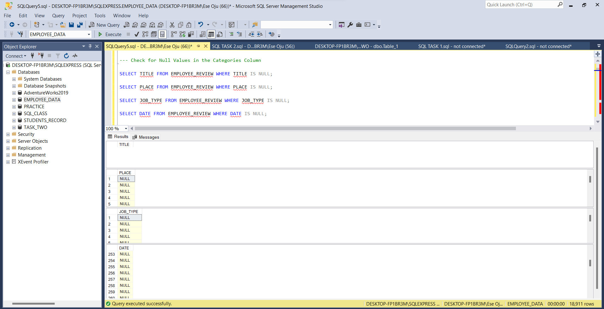

---

-	The Null Values in the Categories Columns were replaced by ‘Unspecified’

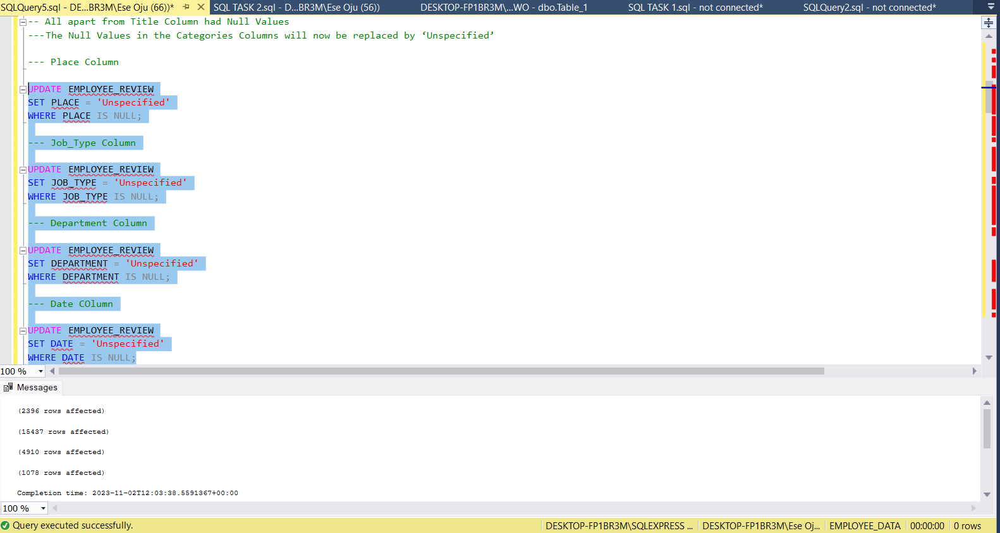

---

-	I checked for Null values in the Values columns

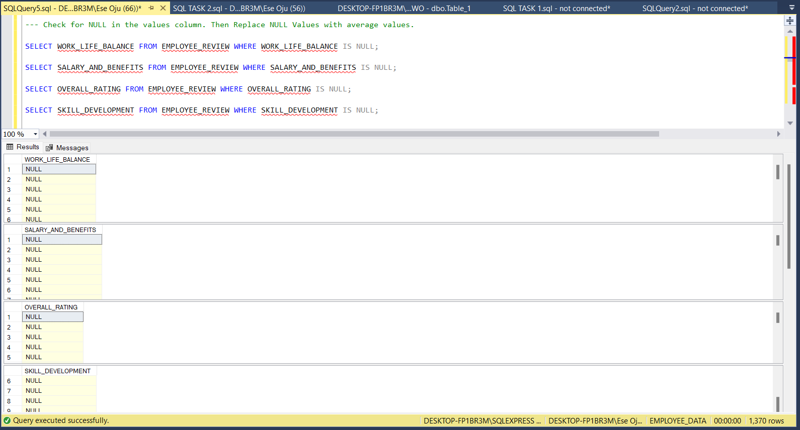

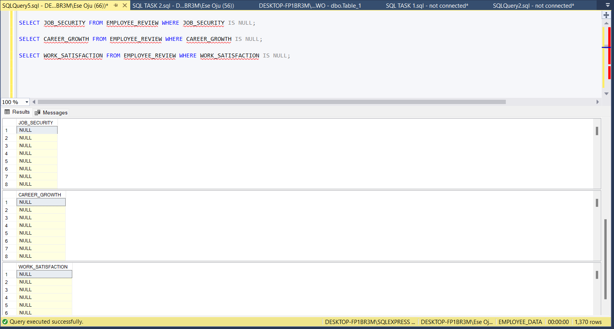

---

-	Average Values in the respective columns were calculated using the SELECT ROUND AVG Syntax.

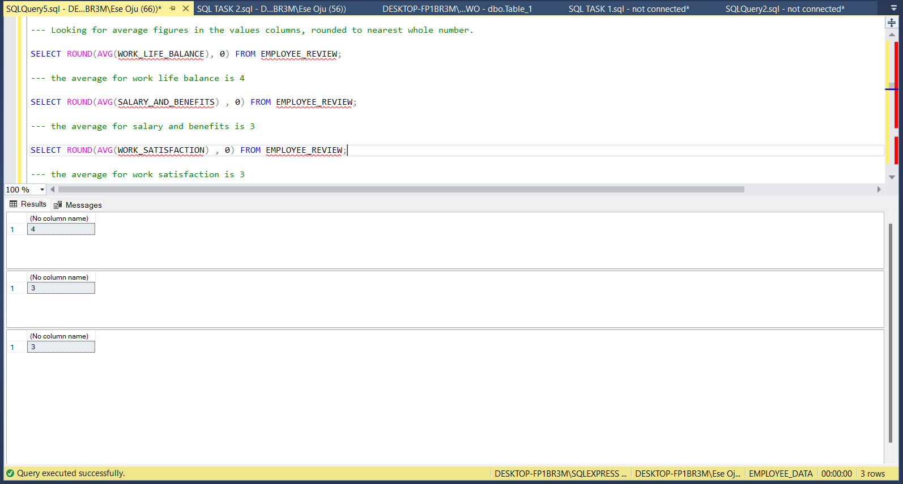

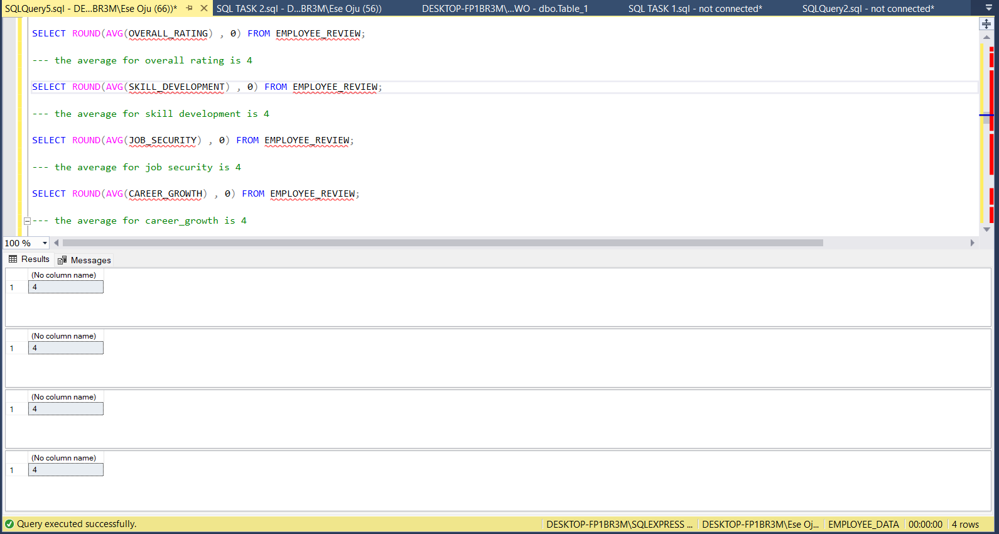

---

-	The Null Values were replaced by average.

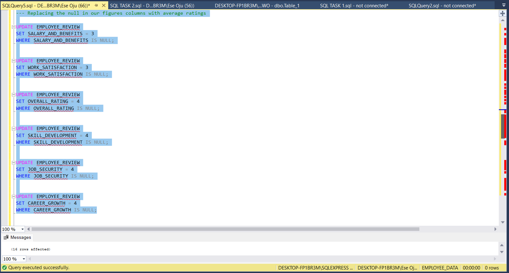

---

# DATA ANALYSIS USING SQL

1. The top 5 titles in software development with work life balance rating higher than 4 and salary and benefits rating higher than 4.5 was sorted and filtered using SELECT TOP 5 syntax. They are:
   
- Senior Analyst
- Software Consultant, Python
- Associate Consultant
- Associate Consultant
- Associate Consultant

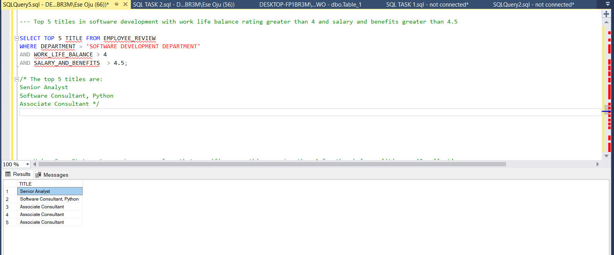

---

2. USING THE 'CASE' STATEMENT, CREATE A NEW COLUMN THAT SPECIFIES EVERYTHING GREATER THAN 4 FOR THE WHOLE QUALITIES AS "EXCELLENT", HAVING ATLEAST TWO QUALITIES GREATER THAN 3 AS "GOOD" AND EVERY OTHER THING AS "POOR" 

---

Using the 'CASE' statement in SQL, I created a new column called "Remark" that assigns a classification to a set of qualities based on the stipulated conditions. The qualities under evaluation include attributes like overall_rating, work_life_balance, skill_development, salary_and_benefits, job_security, career_growth, and work_satisfaction.

- If all of these qualities have ratings greater than 4, they are classified as "Excellent" in the "Remark" column.
- If at least two of these qualities have ratings greater than 3, they are classified as "Good" in the "Remark" column.
- In all other cases, these qualities are classified as "Poor" in the "Remark" column.

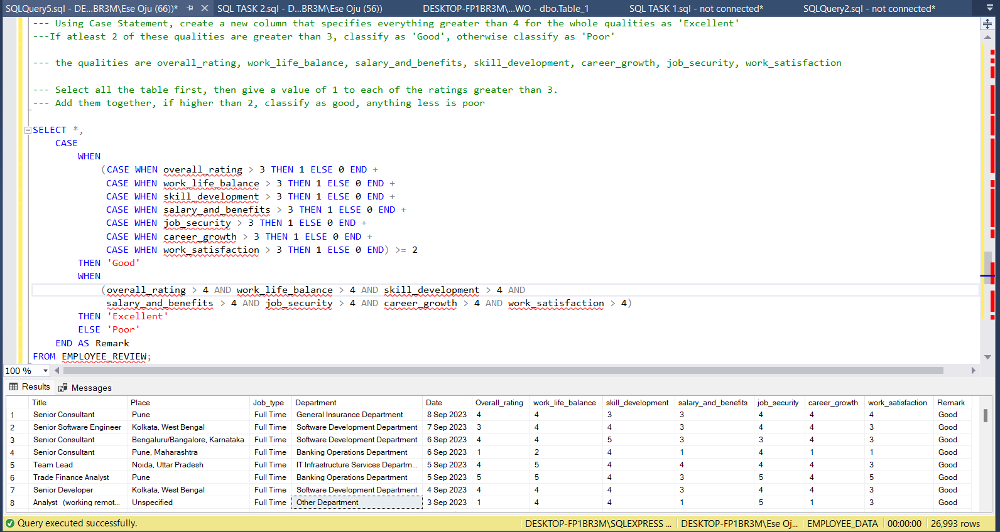

---
Using ALTER function, I added ‘Remark’ Column to my dataset.

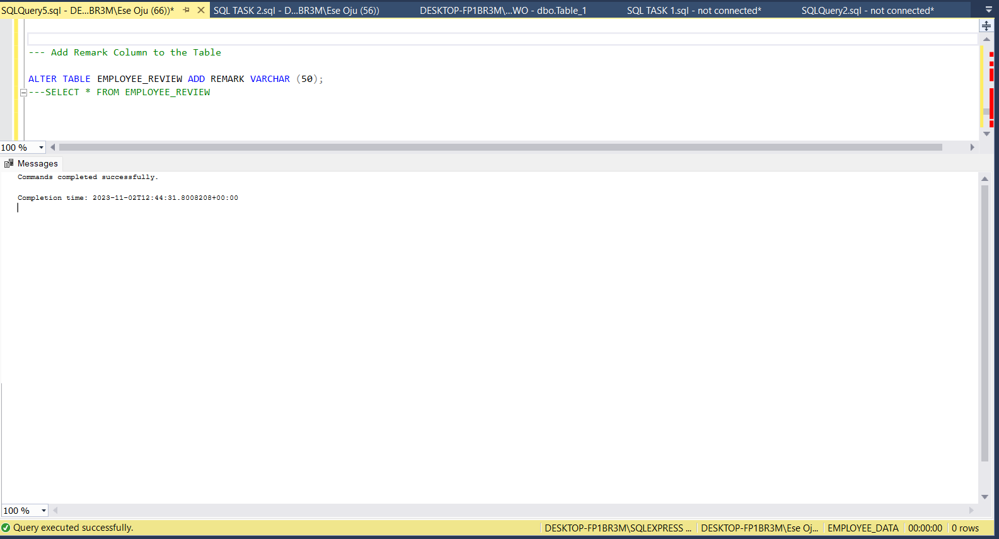

--- 

The ‘Remark’ Column has been added to the dataset but there are no values. Only the column name is visible.

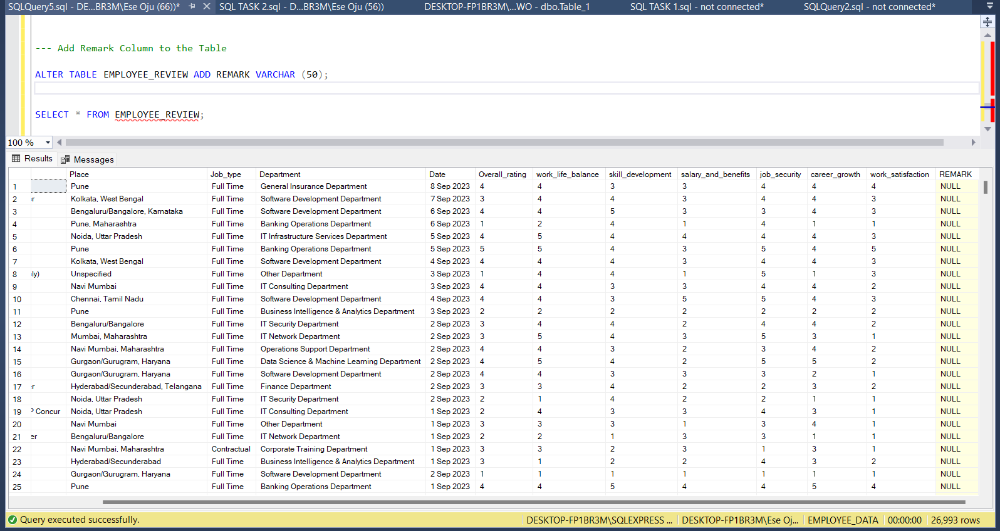

---

I populated the ‘Remark’ Column with actual values using UPDATE and SET functions
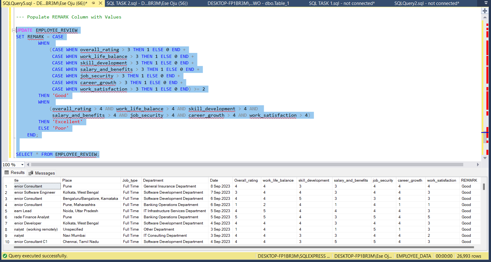

---

# CONCLUSION

This project focused on the analysis of employee reviews, with a key emphasis on:

- Handling missing data effectively.
- Categorizing job quality based on predefined criteria.
- I successfully identified software development jobs that exhibit:
   Work-life balance ratings greater than 4 and Salary and benefits ratings greater than 4.5. Employees who are Senior Analysts, Software Consultants Python, and/or Associate Consultants met these criteria.
- I appreciate that more inferences can be drawn from this dataset and this organisation can make better data driven decisions geared towards making employees feel more fulfilled at work.

---

# CHEERS! 😄

 
